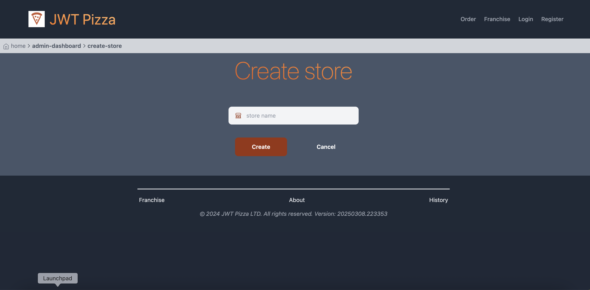

## Self attacks:
  ### Tony attacking self:
    Date: 4/15/2025
    
    Classification: Path Traversal
    
    Severity: 9
    
    Description: Can navigate to the create franchise or create store pages without being logged in by using the correct URL.  However, without an authtoken, the requests to create a store or franchise get denied.
    
    Images: 
    

  

    Fix: Check for the correct level of authorization on those pages
    
## Peer attacks:
  ### Tony attacking Benson:
  
    Date: 4/15/2025
    
    Classification: Injection
    
    Severity: 7
    
    Description: Can update columns outside of the intended columns in the updateUser function.  However, as SQL prevents primary key (User ID) from being updated, this is not very severe.
    
    This is the SQL query as it arrived to the database: 
    UPDATE user SET password='hashedpassword', email='hacker@jwt.com', id = '1' WHERE id=5911
    
    Image: 
 

    Fix: Sanitize user inputs
